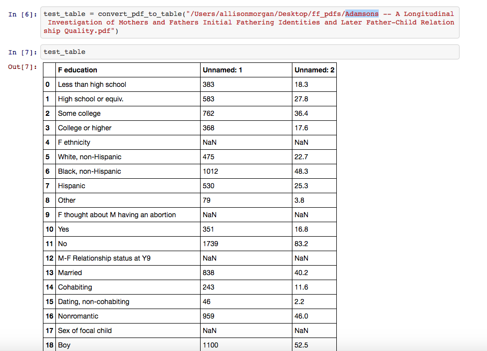

```{r setup, message=FALSE, warning=FALSE, include=FALSE}
#devtools::install_github("hadley/emo")
#' example emojis: https://github.com/hadley/emo
library(emo)
```  
  
Motivation
========================================================
- Problem: High dimensional data with few observations
- Goals: 
    * Increase predictive accuracy
    * Give back to the Fragile Families community
    * Develop machine-facilitated meta-analysis
- Approach: Human-in-the-loop feature engineering
    * Harness the substantive knowledge within the Fragile Families research community
    * But how?


First approach: Text mining
========================================================
Convert 634 Fragile Family articles from PDF to plain text

- Goal: Understand which variables are associated with challenge outcomes
- Methods: Machines or people? or both?
    * Scrape regression tables
        * All variables?
        * Only variables that were significant?
    * Scrape text
        * Entire paper?
        * Abstract?
        
Example table        
========================================================


Example scraped table        
========================================================


Text mining abstracts
========================================================


Text mining abstracts
========================================================
- Use Amazon Mechanical Turk (MTurk) to discover dependent variables and outcomes
- Pivot
    * Tables are messy 
      * Focal relationships not immediately clear from variables in tables
    * Discovering cause and effect from abstracts is a difficult task for Turkers (or machines)
  
Second approach: Consult the experts 
========================================================
Wiki Survey

- Reach out to authors of Fragile Families challenge (expert opinion) to improve model feature selection
- Experts
    * Email every author in the Fragile Families Database
    * Used MTurk to find author's:
        * email
        * affiliation
        * discipline
        * some Turkers gave the author's current position (e.g., Assistant Professor)
- Create weights from Wiki Surveys to inform machine learning model priors 

Wiki Survey
========================================================


Wiki Survey
========================================================
```{r wiki_survey_experts, echo = FALSE}
outcomes <- c("eviction", "GPA", "grit", "job training", "layoffs", "material hardship")
votes <- c(431, 270, 105, 0, 0, 531)
users <- c(13, 11, 2, 0, 0, 19)
turkers <- data.frame(outcomes = outcomes, votes = votes, users = users)
library(knitr)
kable(turkers)
```

- Low response rate and not all outcomes were answered (summer of auto-reply) 

Third approach: Consult the masses
========================================================
- Discover unmeasured and important factors with collective wisdom
- You guessed it: create a Wiki Survey for MTurk
    
```{r wiki_survey_mturk, echo = FALSE}
outcomes <- c("eviction", "GPA", "grit", "job training", "layoffs", "material hardship")
votes <- c(3692, 5062, 4355, 4305, 3821, 5486)
users <- c(113, 135, 110, 127, 115, 127)
turkers <- data.frame(outcomes = outcomes, votes = votes, users = users)
kable(turkers)
```    

- Compare and select features with the combined knowledge of experts and the public

User generated ideas
========================================================


Dot plots
========================================================


<!--
Dot plots
========================================================

-->

<!--
Dot plots
========================================================

-->

<!--
Dot plots
========================================================

-->

Possible improvements
========================================================
- Survey distribution
- Mapping ideas to variables
    * Consult Fragile Families administrators (e.g. does IQ map to PPVT score or Woodcock-Johnson)?
    * Idea moderation 

<!-- Footnotes -->

[^1]: http://www.fragilefamilieschallenge.org/