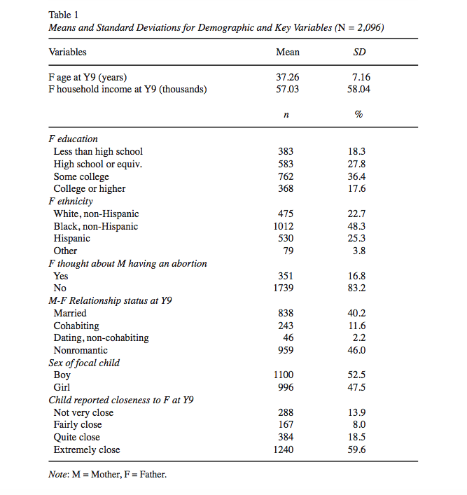
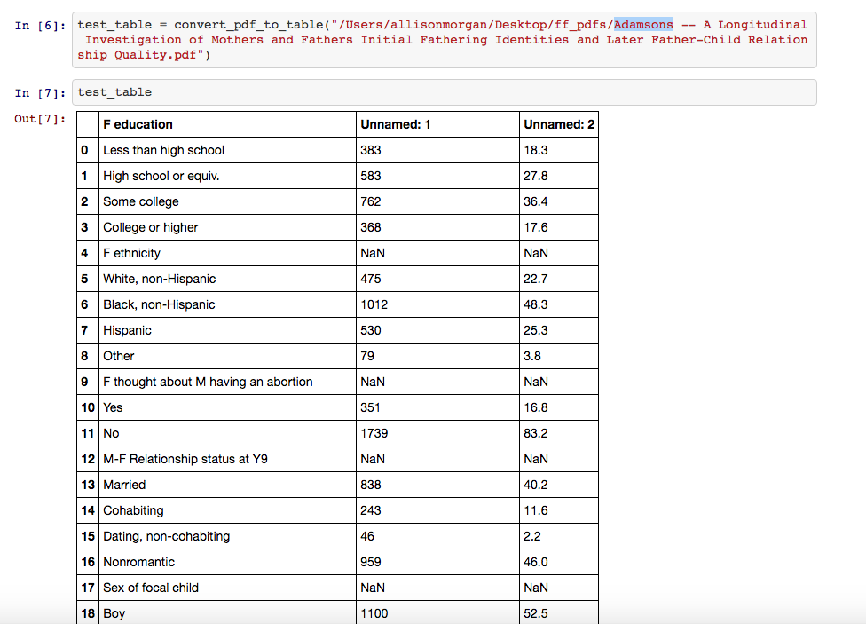
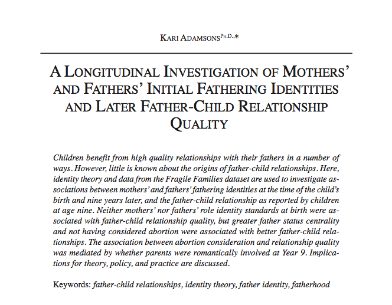

Comparative Machine Learning and the Fragile Families Project 
========================================================
author: Fragile Families Team - Part 1 | Ridhi Kashyap, Allie Morgan, Kivan Polimis, Adaner Usmani
date: 30-06-2017
autosize: true

  
Motivation
========================================================
Fragile Families Challenge 👩‍👦‍👦

- Compare modeling approaches
    * "Breiman (2001) characterizes these as two different cultures of modeling: one that focuses on informativeness and one that focuses on predictive performance"[^1].
- Focus on informativeness
    * Use the knowledge within authored Fragile Families papers
    * But how?

First approach: Text mining
========================================================
Convert .pdfs of Fragile Family text for analysis 

- Analysis
    * Scrape tables for variables used
        * all variables
        * only variables that were significant
    * Use text mining methods on
        * entire papers
        * abstracts
        
Example table        
========================================================

Example scraped table        
========================================================

Text mining abstracts
========================================================

Text mining abstracts: Wiki Survey
========================================================
- Use Amazon Mechanical Turk (MTurk) to discover focal relationships
    * dependent variable and likely predictors
- Pivot
    * Tables are messy 💩
      * Focal relationships not immediately clear from variables in tables
    * Discovering cause and effect from abstracts is a difficult task for Turkers (or machines)
  

Second approach: Consult the experts 
========================================================
Wiki Survey

- Reach out to authors of Fragile Families challenge (expert opinion) to improve model feature selection
- Experts
    * Email every author in the Fragile Families Database
    * Used MTurk to find author's:
        * email
        * affiliation
        * discipline
        * some Turkers gave the author's current position (e.g., Assistant Professor)
- However, low response rate and not all outcomes were  (summer of auto-reply) ⛔

Third approach: Consult the masses
========================================================
- Discover unmeasured and important factors with collective wisdom
- You guessed it: Create a Wiki Survey for MTurk
  
Possible improvements 👷
========================================================
- Consult Fragile Families administrators to improve mapping of Wiki Survey concepts to variables
    * e.g., does child's IQ (crowdsourced recommendation) map on better to PPVT score or Woodcock-Johnson measure?
- We became more knowledgeable of codebook:
    * discovered crowdsourced recommendations (e.g., neighborhood quality) did exist in the codebook
        * neighborhood has: graffiti, gang presence, presence of vacant/abandoned/boarded-up buildings, etc.
    * also, found multiple variables that map onto mother's non-standard work hours
    
    
Focus on informativeness
========================================================
- Select features with the combined knowledge of experts and the public 
    * but also compare them too
- Create weights from Wiki Surveys to inform machine learning model priors 

Ladder plots
========================================================

Ladder plots
========================================================

Ladder plots
========================================================

Ladder plots
========================================================

<!-- Footnotes -->

[^1]: http://www.fragilefamilieschallenge.org/
